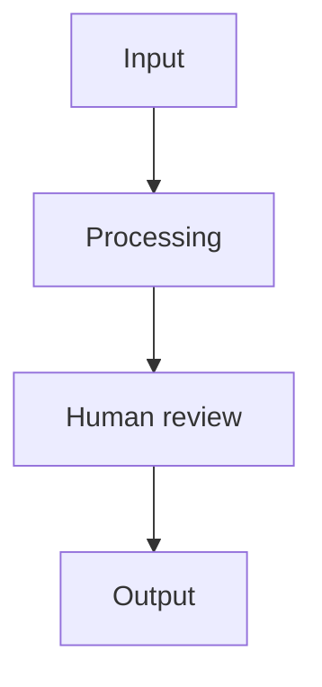

# Project Name

One-line description.

Short explanation of what this repository explores, builds, or documents.

## Status

**Phase:** research / prototype / early implementation / maintained / archived.

This is not a production-grade tool or complete framework unless explicitly stated.

## Problem

Describe the problem this repository addresses.

Explain why the problem matters in cybersecurity, GRC, assurance, incident response, third-party risk, operational resilience, or related work.

## Approach

Explain how the project approaches the problem.

Possible angles:

- structured methodology;
- machine-readable artifacts;
- evidence-driven assessment;
- threat-informed scenarios;
- human review;
- AI-assisted drafting or implementation;
- rules-based validation;
- clean-room / public-source research.

## What exists today

- Current artifact or capability 1.
- Current artifact or capability 2.
- Current artifact or capability 3.

## What does not exist yet

- Missing capability 1.
- Missing capability 2.
- Missing capability 3.

## Core concept

Short explanation of the project flow.



## Design decisions

Capture the main assumptions and trade-offs.

Useful questions:

- Why this structure?
- Why this standard, framework, or format?
- What is intentionally out of scope?
- What trade-offs were accepted?
- What may change later?

For more detail, use a dedicated file such as:

- `docs/design-decisions.md`
- `docs/architecture-decisions.md`
- `docs/assumptions-and-trade-offs.md`

## Repository structure

```text
docs/       Documentation and methodology notes
src/        Source code, if applicable
schemas/    JSON, YAML, or schema artifacts, if applicable
examples/   Synthetic examples only
tests/      Tests, if applicable
```

## AI-assisted, human-owned

This project may use AI as an assistant for drafting, coding, reviewing, and structuring ideas.

The problem framing, methodology, validation, and final decisions remain human-owned.

AI output is treated as a draft, not as an authority.

## Personal disclaimer

This repository reflects personal research, ideas, experiments, and opinions.

It does not represent, imply, or communicate the views, positions, methodologies, policies, control libraries, tools, data, decisions, or official statements of any current or former employer, client, customer, vendor, institution, or affiliated organization.

## License

Describe the license model clearly.

Example mixed-license model:

- Code, scripts, schemas, machine-readable artifacts, validation logic, and tooling are licensed under Apache License 2.0, unless otherwise stated.
- Documentation, diagrams, methodology notes, research notes, explanatory text, and narrative framework content are licensed under Creative Commons Attribution 4.0 International, unless otherwise stated.

Third-party materials, standards, frameworks, regulatory texts, external references, and public-source materials remain subject to their own licenses, terms, and attribution requirements.

## Notes before making public

Before making this repository public, review for:

- secrets, tokens, credentials, API keys, or private URLs;
- personal data, emails, phone numbers, customer names, vendor names, or real system names;
- employer-specific methodology, control wording, questionnaire wording, internal mappings, findings, or assessment results;
- non-public data, screenshots, exports, diagrams, or examples;
- unclear licensing or third-party material reuse;
- wording that makes the project sound more mature than it is.
